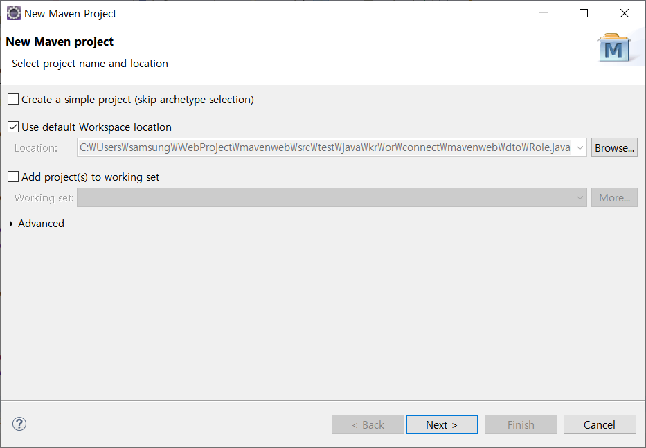
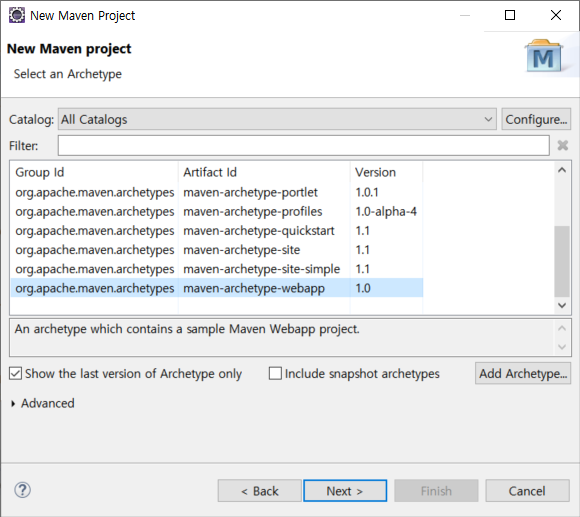
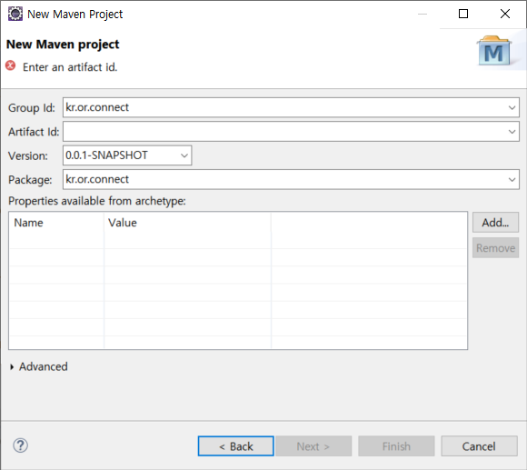
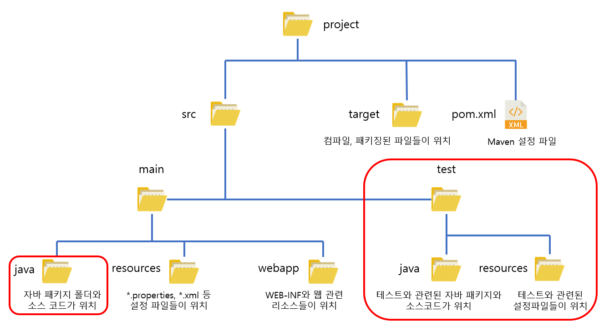

# 목차

### [JSTL와 EL](#jstl과-el)

### [Maven](#maven이란)

### [JDBC](#jdbc란)

### [try-with-resources](#try-with-resources-구문)

### [Spring Framework](#Spring-Framework란)

### [Spring IoC, DI 컨테이너](#Spring-IoC와-DI-컨테이너)

### [XML 파일을 이용한 설정](#xml-파일을-이용한-설정)

### [DI 의존성 주입을 확인해보기](#di-의존성-주입을-확인해보기)

### [Java Config를 이용한 설정](#java-config를-이용한-설정)

# JSTL과 EL

JSTL(JavaServer Pages Standard Tag Library)

JSTL은 태그를 통해 JSP 코드를 관리하는 라이브러리로서, 가독성을 좋게 해준다.

라이브러리이기 때문에 다운받아서 프로젝트에 추가해서 사용해야 한다.

```jsp
<%@ taglib uri="http://java.sun.com/jsp/jstl/core" prefix="c"%>
<%@ taglib uri="http://java.sun.com/jsp/jstl/fmt" prefix="fmt"%>
<%@ taglib uri="http://java.sun.com/jsp/jstl/functions" prefix="fn"%>
```

c라는 prefix로 시작하는 태그는 위 uri에서 가져오겠다라는 것을 알려주는 의미

HTML 코드 내에 Java 코드인 `<%= if %>`  :arrow_right: `<c:if>` , `<%= for%>`  :arrow_right: `<c:forEach>` 로 대체하여 사용

JSTM은 XML 데이터 처리와 조건문, 반복문, 국제화와 지역화와 같은 일을 처리학 위한 JSP 태그 라이브러리를 추가하여 JSP 사양을 확장

JSTL은 JSP 페이지 내에서 자바 코드를 바로 사용하지 않고 로직을 내장하는 효율적인 방법을 제공한다.


| 태그            | 설명                                                   |
| --------------- | ------------------------------------------------------ |
| `<c:if>`        | 조건문 if를 사용하는 것처럼 조건 블록 설정             |
| `<c:forEach>`   | 다른 언어의 loop 문 items 속성에 배열을 할당할 수 있음 |
| `<c:set>`       | 변수에 값을 할당                                       |
| `<c:out>`       | 값을 출력                                              |
| `<c:choose>`    | switch 문과 비슷                                       |
| `<c:when>`      | switch 문의 case에 해당                                |
| `<c:otherwise>` | swtich 문의 default에 해당                             |


예

```html
1. <c:set> 변수 선언하는 태그
<c:set var="변수이름" value="값" />
이렇게 선언하면 ${변수이름}으로 사용할 수 있다.
이 변수는 내부적으로 자바 변수로 선언되는게 아니라 page 데이터 영역의 애트리뷰트로 선언되기 때문에 <%=변수이름%> 형태로 출력될 수 없다.

2. <c:remove> 변수 제거할 때 사용하는 태그
<c:remove var="변수이름" />

특정 영역의 변수만 제거하고 싶으면
<c:remove var="변수이름" scope="request"/>

3. <c:out> 변수 내용을 출력할 때 사용하는 태그
EL로도 출력할 수 있지만, 아래와 같이 태그가 포함된 변수를 escapeXml 항목에 true|false 지정해주어 태그를 포함해서 출력할지, 적용해서 출려갈지 결정할 수 있다.
<c:set var="aaa" value="<font color=red>123</font>"></c:set>
<c:out value="${aaa}" escapeXml="true"/>

4. <c:if test="true|false"> test 안의 내용이 t/f에 따라서 출력할 지 안할 지를 결정
<c:if test="${ 10 > 0 }">
	True<br>
</c:if>
test 부분에 EL을 사용해서 구체적으로 활용할 수 있다.

5. <c:choose> switch문
<c:choose>
	<c:when test="${10 > 9}">
		10<br>
	</c:when>
	<c:when test="${9 > 8}">
		9<br>
	</c:when>
	<c:otherwise>
		0이상<br>
	</c:otherwise>
</c:choose>
맨 처음 10만 출력된다.

6. <c:forEach> for문과 비슷
1~10 출력
<c:forEach var="임시변수명" begin="1" end="10">
	${임시변수명}<br>
</c:forEach>

1~10에서 2씩 증가하면서 출력
<c:forEach var="임시변수명" begin="1" end="10" step="2">
	${임시변수명}<br>
</c:forEach>

배열의 내용 하나씩 출력
<c:forEach var="임시변수명" items="${배열이름}">
	${임시변수명}<br>
</c:forEach>

7. <c:forTokens> 문자열에 포함된 토큰을 분리해서 각각의 토큰에 대해 반복 처리를 수행하도록 만드는 기능
<c:forTokens var="임시변수명" items="111!222@333" delims="!@">
	${임시변수명}<br>
</c:forTokens>
111, 222가 따로 분리되어 출력된다.

8. <fmt:formatDate> 날짜와 관련된 태그
<fmt:formatDate value="<%=new Date() %>" type="both"/>
type이 both이면 날짜와 시간 모두 출력, date/time 둘 중 하나만 쓰면 하나만 출력

9. <fmt:formatNumber> 숫자와 관련된 태그
세 자리마다 쉼표가 출력
<fmt:formatNumber value="1000000" groupingUsed="true"/>
소수점 둘째짜리까지만 출력
<fmt:formatNumber value="3.141592" pattern="#.##"/>
```


EL(Expression Language)

EL은 JSP의 출력 문법을 대체하는 표현 언어

`<%= i %>` JSP에서의 값 표기법이며, i는 변수

`${ i }` EL에서의 값 표기법이며, i는 이름


EL 표기법에서 파라미터 값은 param 키워드를 통해 가져올 수 있다.

또한 JSP 값 표기법에서 파라미터는 문자열이지만, EL에서 숫자는 숫자로, 문자열은 문자열로 인식한다.

예

요청 : ~ / ~ /example.jsp?a=10

```
<%= request.getParameter("a") + 100 %> // 10100, a가 문자열이기 때문에
${param.a + 100}  // 110, 10을 정수형으로 인식
```


JSP 파일에 스크립틀릿 <%= %> 를 사용하는 것보다 JSTL, EL을 사용하는 것을 권장한다고 한다.

그 이유는 HTML 태그 들여쓰기시 가독성이 떨어지기 때문이다.

보통 JSTL와 EL은 함께 사용


## References

- https://daesuni.github.io/jstl/
- https://victorydntmd.tistory.com/156
- https://programmingsummaries.tistory.com/84


---

# Maven이란

Maven은 개발시에 반복적으로 진행했던 작업들을 지원하기 위한 도구이다.

Maven을 사용하면 빌드, 패키징, 문서화, 테스트와 테스트 리포팅, git, 의존성 관리, SVN 등과 같은 형상관리서버와 연동, 배포 등의 작업을 손쉽게 할 수 있다.

Maven을 이해하려면 CoC(Convention over Configuration)라는 단어를 먼저 이해해야 한다.

CoC란 일종의 관습을 말하는데, 예를 들면 소스 파일은 특정 위치에 컴파일된 파일들은 어떤 위치에 있어야 한다는 등 미리 위치를 정해놨다는 것이다.

이 말은 관습에 이미 익숙한 사용자는 Maven을 잘 사용할 수 있지만 익숙하지 않은 사용자는 이러한 제약사항에 대해 어려움을 느낄 수 있다.


Maven의 이점

편리한 의존성 라이브러리 관리, JSTL의 경우 사용하기 위해서는 파일을 다운로드 하여 /WEB-INF/lib 폴더에 복사하여 사용했었는데 이와 같은 라이브러리들이 많아진다면 관리하기 불편해진다.

Maven을 사용하면 설정 파일(pom.xml)에 몇 줄 추가해줌으로써 직접 다운로드할 필요없이 라이브러리를 사용할 수 있다.

프로젝트가 클수록 개발자 또한 많아지는데 Maven을 사용하게 되면 Maven에 설정한 대로 모든 개발자가 일관된 방식으로 빌드를 수행할 수 있게 된다.

Maven은 또한 다양한 플러그인을 제공해줘서, 굉장히 많은 일들을 자동화시킬 수 있다.


Maven 기본

Maven 프로젝트를 생성하면 하위 폴더에 pom.xml 파일이 생긴다.

```xml
<project xmlns="http://maven.apache.org/POM/4.0.0"
    xmlns:xsi="http://www.w3.org/2001/XMLSchema-instance"
    xsi:schemaLocation="http://maven.apache.org/POM/4.0.0 http://maven.apache.org/maven-v4_0_0.xsd">
    <modelVersion>4.0.0</modelVersion>
    <groupId>kr.or.connect</groupId>
    <artifactId>examples</artifactId>
    <packaging>jar</packaging>
    <version>1.0-SNAPSHOT</version>
    <name>mysample</name>
    <url>http://maven.apache.org</url>
    <dependencies>
        <dependency>
            <groupId>junit</groupId>
            <artifactId>junit</artifactId>
            <version>3.8.1</version>
            <scope>test</scope>
        </dependency>
    </dependencies>
</project>
```


| 태그         | 설명                                                         |
| ------------ | ------------------------------------------------------------ |
| project      | pom.xml 파일의 Root Element                                  |
| modelVersion | POM model의 버전                                             |
| groupId      | 프로젝트를 생성하는 조직의 고유 아이디를 결정, 일반적으로 도메인 이름을 거꾸로 적는다. |
| artifactId   | 해당 프로젝트에 의하여 생성되는 artifact의 고유 아이디를 결정, Maven을 이용하여 pom.xml을 빌 드할 경우 다음과 같은 규칙으로 artifact가 생성된다. artifactid-version.packaging, examples-1.0-SNAPSHOT.jar |
| packaging    | 해당 프로젝트를 어떤 형태로 packaging 할 것인지 결정, jar, war, ear 등이 해당 |
| version      | 프로젝트의 현재 버전, 추후 살펴보겠지만 프로젝트가 개발 중일 때는 SNAPSHOT을 접미사로 사용, Maven의 버전 관리 기능은 라이브러리 관리를 편하게 한다. |
| name         | 프로젝트 이름                                                |
| url          | 프로젝트 사이트 URL                                          |


Maven을 이용할 경우 얻게 되는 이점 중 하나는 Dependency Management 기능이다.

`<dependencies>` 엘리먼트 안에 필요한 라이브러리를 지정하여 사용.


## Maven 프로젝트 생성

1. 이클립스에서 File에서 New를 선택
2. Maven Project를 찾아서 클릭
3. New Maven Project 창이 나오는데 Next 클릭




4.  그 다음 프로젝트 탬플릿인 Archetype을 선택해야 한다. 여기서는 Maven을 이용하여 웹 애플리케이션을 개발할 것이므로 아래 그림과 같이 `maven-archtype-webapp` 을 선택한 후 Next 클릭
   -  :heavy_plus_sign: 어떤 아키타입을 선택하느냐에 따라 생성하는 파일이나 라이브러리가 다르다.




5. 프로젝트 이름 설정
   - Group Id 는 보통 프로젝트의 도메인이나 회사의 이름을 거꾸로 적는다.
   - Artifact Id 는 프로젝트 이름
   - 버전은 보통 아래와 같이 설정하므로 따로 수정 x
   - Package 이름은 Group Id와 Artifact Id가 조합된 이름이 된다.
   - Finish를 누르면 프로젝트 생성




6. 추가로 필요한 폴더 추가
   - 아래 그림은 프로잭트의 디렉터리 구조
   - 빨간색 부분은 자동으로 생성되지 않아서 필요에 따라 만들어서 사용
   - Maven으로 생성된 프로젝트의 경우 자바 소스는 src/main/java 폴더에 생성된다.
   - 웹 애플리케이션과 관련된 HTML, CSS 등은 src/main/webapp 폴더에서 작성해야 한다.




----

# JDBC란

- JDBC(Java Database Connectivity)
- 자바를 이용한 DB 접속과 SQL 문장 실행, 그리고 결과로 얻어진 데이터의 핸들링을 제공하는 방법과 절차에 관한 규약

- 자바 프로그램 내에서 SQL문을 실행하기 위한 자바 API

- JAVA는 표준 인터페이스인 JDBC API를 제공


## JDBC 환경 구축

- JDK 설치
- JDBC 드라이버 설치(Maven(pom.xml)에 의존성 추가)

```xml
<dependency>   
	<groupId>mysql</groupId>   
    <artifactId>mysql-connector-java</artifactId>
    <version>5.1.45</version>
 </dependency>
```


## JDBC 동작 순서

1. import java.sql.*; 
2. 드라이버 로드
3. Connection 객체를 생성 (DB에 **접속**하는 부분, connection 인터페이스)
4. Statement 객체를 생성 및 질의 수행 (SELECT 문과 같은 쿼리문 생성하고 실행, Statement 인터페이스)
5. SQL 문에 결과물이 있다면 ResultSet 객체를 생성 
6. 모든 객체를 닫음


## JDBC 클래스의 생성 관계

DriverManager :arrow_right: Connection :arrow_right: Statement :arrow_right: ResultSet


## JDBC 단계별 설명

1. import

```java
import java.sql.*;
```

2. 드라이버 로드

```java
Class.forName( "com.mysql.jdbc.Driver" );
```

- 패키지명.클래스, 해당 객체가 메모리에 올라감, DB 벤더에 따라 이름 달라짐

3. Connection 객체를 생성

```java
String dburl  = "jdbc:mysql://localhost/dbName";
Connection con =  DriverManager.getConnection ( dburl, ID, PWD );
```

- DB에 접속, IP 혹은 URL, ID, PWD 입력해서 접속


### 예 (oracle DB에 접속할 경우)

```java
public static Connection getConnection() throws Exception{
	String url = "jdbc:oracle:thin:@117.16.46.111:1521:xe";
	String user = "smu";
	String password = "smu";
	Connection conn = null;
	Class.forName("oracle.jdbc.driver.OracleDriver");
	conn = DriverManager.getConnection(url, user, password);
	return conn;
}
```


4. Statement 객체를 생성 및 질의 수행

```java
// Statement 생성
Statement stmt = con.createStatement();

// 질의 수행
ResultSet rs = stmt.executeQuery("select no from user");

// 참고
stmt.execute(“query”);             //any SQL
stmt.executeQuery(“query”);     //SELECT
stmt.executeUpdate(“query”);   //INSERT, UPDATE, DELETE
```

5. SQL 문에 결과물이 있다면 ResultSet 객체를 생성하고 결과 받기

```java
ResultSet rs = stmt.executeQuery("select no from user");
while (rs.next()) // false는 반환값이 없을 경우를 뜻함 
      System.out.println( rs.getInt( "no") );
```

6. 모든 객체를 닫음 (순차적으로 닫아줘야함)

```java
rs.close();
stmt.close();
con.close();
```


### 예)

```java
public List<GuestBookVO> getGuestBookList(){
		List<GuestBookVO> list = new ArrayList<>();
		GuestBookVO vo = null;
		Connection conn = null;
		PreparedStatement ps = null;
		ResultSet rs = null;
		try{
			conn = DBUtil.getConnection();
			String sql = "select * from guestbook";
			ps = conn.prepareStatement(sql);
			rs = ps.executeQuery();
			while(rs.next()){
				vo = new GuestBookVO();
				vo.setNo(rs.getInt(1));
				vo.setId(rs.getString(2));
				vo.setTitle(rs.getString(3));
				vo.setConetnt(rs.getString(4));
				vo.setRegDate(rs.getString(5));
				list.add(vo);
			}
		}catch(Exception e){
			e.printStackTrace();
		}finally {
			DBUtil.close(conn, ps, rs);
		}		
		return list;		
	}
```


```java
public int addGuestBook(GuestBookVO vo){
		int result = 0;
		Connection conn = null;
		PreparedStatement ps = null;
		try{
			conn = DBUtil.getConnection();
			String sql = "insert into guestbook values("
					+ "guestbook_seq.nextval,?,?,?,sysdate)";
			ps = conn.prepareStatement(sql);
			ps.setString(1, vo.getId());
			ps.setString(2, vo.getTitle());
			ps.setString(3, vo.getConetnt());
			result = ps.executeUpdate();
		}catch(Exception e){
			e.printStackTrace();
		}finally {
			DBUtil.close(conn, ps);
		}
		
		return result;
	}
```


```java
public static void close(Connection conn, PreparedStatement ps){
		if (ps != null) {
			try {
				ps.close();
			} catch (SQLException e) {e.printStackTrace(); }
		}
		if (conn != null) {
			try {
				conn.close();
			} catch (SQLException e) {e.printStackTrace();}
		}
	}
```

- Spring JDBC를 이용할 것이므로 여기서는 JDBC가 이러한 순서로 동작되는 것 위주로 이해
- 어떻게 동작되는 것을 알아야 에러 발생시 잘 찾아낼 수 있다.


---

# try with resources 구문


- try()에서 선언한 객체들에 대해서 try 구문이 종료될 때 자동으로 선언한 객체를 close 해주는 기능이다.
- Java7부터 지원한다.
- try에서 선언된 객체가 AutoCloseable을 구현하였다면 Java는 try 구문이 종료될 때 자동으로 객체의 close() 메소드를 호출해준다.
- 이전에는 finally에서 조건문에 해당 객체가 null 인지 아닌지 확인 후에 close()를 호출해주었지만 이 구문에서는 호출해줄 필요가 없다.
- try with resources에서 자동으로 close()가 호출되는 것은 AutoCloseable을 구현한 객체에만 해당된다.
- 만약 사용자 정의 클래스에서 try with resources 을 이용하고자 한다면 AutoCloseable 을 implements 해야 한다.


### 장점

- 코드를 간결하게 만들어 이해하기 쉽고 유지보수가 쉬워진다.

- 또한 try-catch 구문을 이용한 close()를 호출할 필요가 없어 이와 관련된 실수를 줄일 수 있다.


### 예

#### 적용 전

```java
//try with resources, 알아서 close 해줌
		try (Connection conn = DriverManager.getConnection(dburl, dbUser, dbpasswd);
				PreparedStatement ps = conn.prepareStatement(sql)) {
			try (ResultSet rs = ps.executeQuery()) {
				while (rs.next()) {
					String description = rs.getString(1)
					int id = rs.getInt("role_id");
					Role role = new Role(id, description);
					list.add(role);
				}
			} catch (Exception e) {
				e.printStackTrace();
			}
		} catch (Exception ex) {
			ex.printStackTrace();
		}
```


#### 적용 후

```java
		Connection conn = null;
		PreparedStatement ps = null;
		ResultSet rs = null;
		try {
			Class.forName("com.mysql.jdbc.Driver");
			conn = DriverManager.getConnection(dbUrl, dbUser, dbPassword);
			String sql = "SELECT description, role_id FROM role WHERE role_id = ?";
			ps = conn.prepareStatement(sql);
			ps.setInt(1, roleId);
			rs = ps.executeQuery();
			if(rs.next()) {
				String description = rs.getString(1);
				int id = rs.getInt("role_id");
				role = new Role(id, description);
			}
		} catch (Exception e) {
			e.printStackTrace();
		}finally {
			if(rs != null) { 
				try {
					rs.close();
				} catch (SQLException e) {
					e.printStackTrace();
				}
			}
			if(ps != null) {
				try {
					ps.close();
				} catch (SQLException e) {
					e.printStackTrace();
				}
			}
			if(conn != null) {
				try {
					conn.close();
				} catch (SQLException e) {
					e.printStackTrace();
				}
			}
		}
```


## References

- https://codechacha.com/ko/java-try-with-resources/


# Spring Framework란


## Framework란?

이미 만들어져있는, 구현되어져있는 것을 의미


## Spring Framework란?

- 엔터프라이즈급 애플리케이션을 구축할 수 있는 가벼운 솔루션이자, One-Stop-Shop(모든 과정을 한꺼번에 해결)
- 원하는 부분만 가져다 사용할 수 있도록 모듈화가 잘 되어 있다.
- IoC 컨테이너
- 트랜잭션 관리
- MVC Framework를 제공
- AOP 지원
- 도메인 논리 코드와 쉽게 분리될 수 있는 구조를 가지고 있다.


## Spring Framework Modules


[출처: https://docs.spring.io/spring/docs/5.0.0.RC2/spring-framework-reference/overview.html]


- 약 20개의 모듈로 구성, 필요한 모듈만 가져다 사용하면 된다.


## AOP와 Instrumentation

- Spring AOP
  - AOP Aliance와 호환되는 방법
- Spring aspects
  - AspectJ와 통합 제공
- Spring instrument
  - instrument을 지원하는 클래스와 특정 WAS에서 사용하는 클래스와 같은 인터페이스를 구현한 클래스를 제공


## Messaging

- Spring Framework 4에서는 메시지 기반 애플리케이션을 작성할 수 있는 Message, MessageChannel, MessageHandler 등을 제공
- 또한 해당 모듈에는 메소드에 메시지를 맵핑하기 위한 어노테이션도 포함되어 있으며, Spring MVC 어노테이션과 유사


## Data Access와 Integration

- 데이터 액세스와 통합 계층은 JDBC, ORM, OXM, JMS 및 트랜잭션 모듈로 구성되어 있다.
- Spring jdbc
  - 자바 JDBC 프로그래밍을 할 수 있도록 기능 제공
- Spring tx
  - 선언적 트랜잭션 관리를 할 수 있는 기능을 제공
- Spring orm
  - JPA, JDO 및 Hibernate를 포함한 ORM API를 위한 통합 레이어를 제공
- Spring oxm
  - JAXB, Castor, XMLBeans, JiBX 및 XStream과 같은 Object/XML 맵핑을 지원
- Spring jms
  - 메시지 생성 및 사용을 위한 기능을 제공, 4.1 버전부터 spring-messaging 모듈과의 통합을 제공


## Web

- spring-web 
  - 멀티 파트 파일 업로드, 서블릿 리스너 등 웹 지향 통합 기능을 제공한다. HTTP클라이언트와 Spring의 원격 지원을 위한 웹 관련 부분을 제공
- spring-webmvc
  - Web-Servlet 모듈이라고도 불리며, Spring MVC 및 REST 웹 서비스 구현을 포함
- spring-websocket
  - 웹 소켓을 지원
- spring-webmvc-portlet
  - 포틀릿 환경에서 사용할 MVC 구현을 제공


# Spring IoC와 DI 컨테이너


## 컨테이너

- 컨테이너는 인스턴스의 생명 주기를 관리하며, 생성된 인스턴스에게 추가적인 기능을 제공


## IoC(Inversion of Control)

- 컨테이너가 코드 대신 오브젝트의 제어권을 갖고 있어 IoC(제어의 역전)이라 함
- 개발자는 프로그램의 흐름을 제어하는 코드를 작성한다. 그런데 흐름의 제어를 개발자가 하는 것이 아니라 다른 프로그램이 흐름을 제어하는 것을 IoC라고 한다.
- 예를 들면, Servlet 클래스는 개발자가 만들지만, 그 Servlet의 메소드를 알맞게 호출하는 것은 WAS이다. 이렇게 개발자가 만든 클래스나 메소드를 다른 프로그램이 실행시켜주는 것을 제어의 역전이라 한다.


## DI(Dependency Injection), 의존성 주입

- DI는 클래스 사이의 의존 관계를 Bean 설정 정보를 바탕으로 컨테이너가 자동으로 연결해주는 것


- DI 적용 x, 개발자가 직접 인스턴스 생성

```java
class 엔진{

}

class 자동차{
	엔진 v1 = new 엔진();
}
```


- Spring에서 DI가 적용된 예, 어노테이션을 이용해 자동으로 생성
- 엔진 type의 v5 변수에 아직 인스턴스가 할당되지 않음
- 컨테이너가 v1 변수에 인스턴스 할당

```java
@Component
class 엔진{

}
@Component
class 자동차{
	@Autowired
	엔진 v1;
}
```


## Spring에서 제공하는 IoC/DI 컨테이너

- BeanFactory
  - IoC/DI에 대한 기본 기능을 가지고 있다.
- ApplicationContext
  - BeanFactory의 모든 기능을 포함하며, 일반적으로 BeanFactory보다 추천된다.
  - 트랜잭션 처리, AOP 등에 대한 처리를 할 수 있다.
  - BeanPostProcessor, BeanFactoryProcessor 등을 자동으로 등록하고, 국제화 처리, 애플리케이션 이벤트 등을 처리할 수 있다.


# XML 파일을 이용한 설정

- 이클립스에서 MavenProject를 새로 생성
- 생성 후 JDK 사용을 위해 POM.XML을 다음과 같이 수정

```xml
<project xmlns="http://maven.apache.org/POM/4.0.0" xmlns:xsi="http://www.w3.org/2001/XMLSchema-instance"
  xsi:schemaLocation="http://maven.apache.org/POM/4.0.0 http://maven.apache.org/xsd/maven-4.0.0.xsd">
  <modelVersion>4.0.0</modelVersion>

  <groupId>kr.or.connect</groupId>
  <artifactId>diexam01</artifactId>
  <version>0.0.1-SNAPSHOT</version>
  <packaging>jar</packaging>

  <name>diexam01</name>
  <url>http://maven.apache.org</url>

  <properties>
    <project.build.sourceEncoding>UTF-8</project.build.sourceEncoding>
    <spring.version> 4.3.14.RELEASE</spring.version>
  </properties>

  <dependencies>
  
  	<!-- Spring -->
	<dependency>
		<groupId>org.springframework</groupId>
		<artifactId>spring-context</artifactId>
		<version>${spring.version}</version>
	</dependency>
  

    <dependency>
      <groupId>junit</groupId>
      <artifactId>junit</artifactId>
      <version>3.8.1</version>
      <scope>test</scope>
    </dependency>
  </dependencies>
    
    <!-- USE JDK -->
    <build>
    <finalName>mavenweb</finalName>
    	<plugins>
    		<plugin>
	    		<groupId>org.apache.maven.plugins</groupId>
	    		<artifactId>maven-compiler-plugin</artifactId>
	    		<version>3.6.1</version>
	    		<configuration>
	    			<source>1.8</source>
	    			<target>1.8</target>
	    		</configuration>	
    		</plugin>
    	</plugins>
  </build>
    
</project>

```

- POM.XML 추가 이후에 프로젝트에 에러 표시가 난 다음, 프로젝트 우 클릭 후 Maven -> Update Project 해주기
- 이후에 JDK 버전 확인을 휘애 프로젝트 우클릭 -> Properties -> Java Compiler 선택 후 JDK 버전 동일한 지 확인


- 위 과정을 마치면 프로젝트 안에 Artifact ID로 설정한 것이 패키지로 만들어져 있고 그 안에 APP.java가 있는 것을 확인
- 그 다음 test.java에서는 AppTest.java를 확인, AppTest은 TestCase를 상속받고 있고 junit을 이용하여 Test
- 해당 파일을 우 클릭 후 junit 실행하면 아래에 초록색 바가 생성, Maven 프로젝트가 잘 진행되고 있다는 것을 의미


- 이제 DI 테스트를 해봄, 내가 원하는 객체를 내가 생성하는 것이 아니라 Spring이 생성하여 나에게 주입시켜줌

- 공장이 자동으로 만들어줄 객체가 필요, 그러한 객체를 bean이라고 한다.

- UserBean이라는 클래스를 생성

```java
package kr.or.connect.diexam01;

public class UserBean {
	/* Bean 세 가지 특징을 만족해야 한다.
	 * 1)기본생성자를 가지고 있다.
	 * 2)필드는 private하게 선언한다.
	 * 3)getter, setter 메소드를 가진다. getName(), setName() 메소드를 name Property라고 한다. 
	 왜 bean은 이러한 규칙을 만족해야 할까?
	 -> UserBean 자체를 사용자가 생성하는 것이 아닌 누군가가 대신해주기 때문에 규칙들이 있어야 하기 때문
	 *  */
	
	private String name;
	private int age;
	private boolean male;
	
	public UserBean() {
		
	}
	
	public UserBean(String name, int age, boolean male) {
		this.name = name;
		this.age = age;
		this.male = male;
	}

	public String getName() {
		return name;
	}

	public void setName(String name) {
		this.name = name;
	}

	public int getAge() {
		return age;
	}

	public void setAge(int age) {
		this.age = age;
	}

	public boolean isMale() {
		return male;
	}

	public void setMale(boolean male) {
		this.male = male;
	}	
}
```


- 그럼 이 클래스를 Spring이 가진 공장이 만들어내게끔 해야함, 컴퓨터이기 때문에 알려주어야함

- 자동으로 해주는 것은 사용자가 최소한의 정보를 알려주어야함

- Spring의 Bean 팩토리를 이용해서 UserBean을 생성할 것임, 그러면 Spring을 사용해야하기 때문에 Maven에다가 Spring을 추가

```XML
	<!-- Spring -->
	<dependency>
		<groupId>org.springframework</groupId>
		<artifactId>spring-context</artifactId>
		<version>${spring.version}</version>
	</dependency>ㅌ
```


- 그 다음 위에 properties 추가

```XML
<properties>
	<project.build.sourceEncoding>UTF-8</project.build.sourceEncoding>
    <spring.version> 4.3.14.RELEASE</spring.version>
</properties>
```

- properties 안에 들어있는 것들은 상수처럼 사용할 수 있는 것들,  해당 값들이 필요할 때 값 자체로 사용하는 것이 아니라 앞에 태그 이름으로 상수처럼 사용 ex)` <version>${spring.version}</version>`

- 사용하는 이유는 Spring 라이브러리가 다양하기 때문에 dependency가 많아질 텐데 해당 프로젝트에서 버전을 바꾸려할 때 일일이 찾아서 바꾸기 번거로움, 그래서 properties 안에 상수처럼 선언해두고 사용하면 유지보수하기 좋다.


- 현재까지 Spring 공장 쓸거니까 라이브러리 추가함

- 이제 Spring 공장한테 UserBean은 이러한 형태라고 알려주어야 한다.

- 프로젝트 선택 -> new -> src/main 안에 resources 폴더 생성

- resources 폴더는 java 파일과 합쳐있어도 상관은 없지만 관리하기 힘들기 때문에 불리, 이 폴더 안에는 Spring 한테 정보를 주기 위한 파일을 만들어서 관리

- resources 폴더 안에 applicationContext.xml 파일 생성

```XML
<?xml version="1.0" encoding="UTF-8"?>
<beans xmlns="http://www.springframework.org/schema/beans"
	xmlns:xsi="http://www.w3.org/2001/XMLSchema-instance"
	xsi:schemaLocation="http://www.springframework.org/schema/beans http://www.springframework.org/schema/beans/spring-beans.xsd">

	<bean id="userBean" class="kr.or.connect.diexam01.UserBean"></bean>
<!-- 스프링 컨테이너한테 내가 생성할 객체를 대신 생성하게 하는 것, 반드시 정보를 주어야함, 이때 사용되는 element가 <bean> id="" class="" -->
<!-- kr.or.connect.diexam01.UserBean userBean = new kr.or.connect.diexam01.UserBean(); 이랑 같은 의미로 보면 된다. -->
	
	<bean id="e" class="kr.or.connect.diexam01.Engine"/>
	<bean id="c" class="kr.or.connect.diexam01.Car">
		<property name="engine" ref="e"></property>
	
	</bean>

</beans>
```


- XML 파일 인 것을 꼭 명시해주어야 되고 언어셋을 무엇을 쓸 건지 언급해줘야 한다.

```xml
<?xml version="1.0" encoding="UTF-8"?>
```

- root element는 반드시 beans 로 되어 있어야 한다.
- xml schema 설정도 되어있어야 한다.

```xml
<beans xmlns="http://www.springframework.org/schema/beans"
	xmlns:xsi="http://www.w3.org/2001/XMLSchema-instance"
	xsi:schemaLocation="http://www.springframework.org/schema/beans http://www.springframework.org/schema/beans/spring-beans.xsd">
</beans>
```


- 이제 내가 생성할 객체를 생성하게끔 해주기, 그러기 위해서는 반드시 정보를 주어야 한다.
- bean element에  몇 가지 속성을 부여
  - id: 생성할 객체 명
  - class: 내가 만들고 싶은 클래스
- 아래의 설정은 `kr.or.connect.diexam01.UserBean userBean = new kr.or.connect.diexam01.UserBean();` 와 같은 의미이다.

```xml
<bean id="userBean" class="kr.or.connect.diexam01.UserBean"></bean>
```

- Spring 컨테이너는 이런 객체를 하나만 생성해서 가지고 있다, 이를 싱글톤 패턴이라고 한다.


- 이제 설정을 했으니 객체를 생성해보자, src/main/java 안에 ApplicationContextExam01.java 파일 생성

```java
package kr.or.connect.diexam01;

import org.springframework.context.ApplicationContext;
import org.springframework.context.support.ClassPathXmlApplicationContext;

public class ApplicationContextExam01 {

	public static void main(String[] args) {
        //Spring 공장을 만드는 코드, 여러 공장 중 ApplicationContext 공장을 사용
		ApplicationContext ac = new ClassPathXmlApplicationContext("classpath:applicationContext.xml");
		//객체를 생성할 스프링 공장을 생성하고 xml 파일에 정보 넣어놨으니 그대로 동작하면 된다고 알려줌
		//resources 안 xml은 자동으로 classpath로 등록됨
		System.out.println("초기화 완료!");
		
        
        //이 공장한테 얻어올 객체가 UserBean, 실제 생성은 안하고 공장한테 getBean 메소드를 이용해서 얻어낼 것, getBean은 Object 타입으로 반환해주기 때문에 형변환 필요
		UserBean userBean = (UserBean)ac.getBean("userBean");
		//getBean() 함수 인자로 "userBean"을 주었는데 인자는 xml 파일로 가서 이 인자와 일치하는 id를 찾아서 같이 등록되어 있는 class 명을 보고 class를 생성해서 리턴
		userBean.setName("kim");
		
		System.out.println(userBean.getName());
		
		UserBean userBean2 = (UserBean)ac.getBean("userBean");
		
		if(userBean == userBean2)
			System.out.println("같은 인스턴스");
		//싱글톤 패턴을 이용, getBean을 통해 요청을 하더라도 계속해서 만드는 것이 아니라 하나 만든 것을 계속 이용한다
		

	}
}
```

- ApplicationContext 인터페이스 이를 구현하는 다양한 컨테이너가 존재할 것이다.
- XML 파일을 ClassPath에서 읽어들여서 사용하는 객체가 ClassPathXmlApplicationContext인 것 기억
- resources 폴더가 main에 들어있는데 소스폴더이기 때문에 안에 파일들은 자동으로 ClassPath로 자동으로 등록된다. 그렇기 때문에 `classpath:applicationContext.xml` 사용 가능
- bean들이 여러 가지 일 때, bean의 정보들을 다 읽어들여서 전부 생성해서 메모리에 올려둔다.
- getBean의 파라미터로 bean의 id를 넣어주면 된다.
- 이렇게 객체를 대신 생성해주고 싱글톤으로 관리해주는 기능을 IoC, 제어의 역전이라고 한다.


# DI 의존성 주입을 확인해보기

- 두 개의 클래스, Car, Engine 클래스를 생성

#### Engine.java

```java
package kr.or.connect.diexam01;

public class Engine {
	public Engine() {
		System.out.println("Engine 생성자");
	}
	
	public void exec() {
		System.out.println("엔진이 동작");
	}
}
```

#### Car.java

```java
package kr.or.connect.diexam01;

public class Car {
	private Engine v8;
	
	public Car() {
		System.out.println("Car 생성자");
	}

	public void setEngine(Engine e) {
		this.v8 = e;
	}
	
	public void run() {
		System.out.println("엔진을 이용하여 달림");
		v8.exec();
	}
	
	public static void main(String[] args) {
		Engine e = new Engine();
		Car c = new Car();
		c.setEngine(e);
		c.run();
	}
}
```


- 위의 main 문 과정을 제어의 역전으로 넘김, Spring IoC 컨테이너가 만들어줄 것이다.
- Spring 컨테이너가 하게 해주려면 설정 파일에다가 해당 bean들을 등록해주어야 함
- applicatonContext.xml 안에 bean 추가

```xml
<bean id="e" class="kr.or.connect.diexam01.Engine"></bean>
<bean id="c" class="kr.or.connect.diexam01.Car"></bean>
<bean id="c" class="kr.or.connect.diexam01.Car"></bean>
```

- 하지만 위 코드에서는 Engine을 set 하라는 코드가 없음
- 아래와 같이 수정

```XML
<bean id="e" class="kr.or.connect.diexam01.Engine"></bean>
<bean id="c" class="kr.or.connect.diexam01.Car"></bean>
<bean id="c" class="kr.or.connect.diexam01.Car">
	<property name="engine" ref="e"></property> get, set 메소드를 property라고 한다.
</bean>
```

- name이 engine인 property(getEngine 혹은 setEngine) 이라는 메소드를 이야기 하고 bean 태그 안에서는 모두 값을 설정하기 때문에 setEngine이라는 메소드를 의미
- 여기서 name은 setEngine에서 E를 소문자로 바꾼 engine을 의미
- setEngine이라는 메소드는 파라미터는 Engine 타입을 받음
- ref은 위에서 생성된 id가 e인 bean을 여기서 사용하겠다, 그리고 set 메소드의 파라미터를 뜻함


#### ApplicationContextExam02.java

```java
package kr.or.connect.diexam01;

import org.springframework.context.ApplicationContext;
import org.springframework.context.support.ClassPathXmlApplicationContext;

public class ApplicationContextExam02 {

	public static void main(String[] args) {
		ApplicationContext ac = new ClassPathXmlApplicationContext("applicationContext.xml");
		
		Car car = (Car)ac.getBean("c");
		car.run();	
	}
}
```


#### 결과

> Engine 생성자
> Car 생성자
> 엔진을 이용하여 달림
> 엔진이 동작


- 어떤 객체에게 객체를 주입하는 것을 DI라고 하고 장점은 코드를 보면 Car라는 클래스만 등장, 사용자는 사용할 Car 클래스만 알면 된다는 것을 의미, 나중에 Car를 상속받고 있는 Bus 클래스가 생성되도록 XML 파일만 수정해주면 됨
- 실행 클래스의 코드는 바뀌지 않고 XML 파일만 수정하면 된다.
- Spring 버전이 업데이트 되면서 XML 보다는 Annotation이나 java config를 함께 사용해 더 많이 이용됨
- 이 방법만 하더라도 일일이 bean을 설정해줘야 하니 조금 더 편한 방법이 나오게 됨


# Java Config를 이용한 설정

